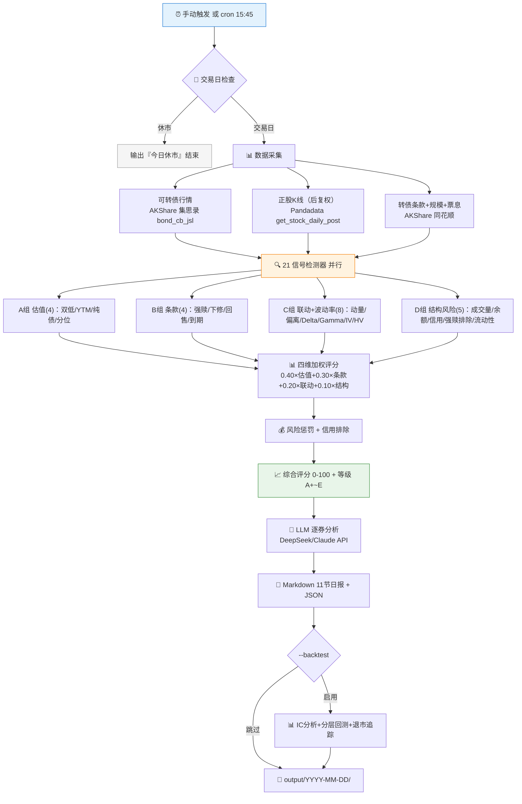

# skill-cb-analyzer

**简体中文 | English**

> A 股可转债每日综合分析系统：双低策略 + 条款事件驱动 + 正股联动 + Black-Scholes 期权定价（Delta/Gamma/Vega） + 历史/隐含波动率 + IC 分层回测 + 退市追踪。21 个信号检测器，四维加权评分（0-100），LLM 逐券深度分析，Markdown + JSON 双格式日报，MCP 协议支持 AI Agent 调用。

<p align="center">
  
  
  
  
  
  
  
</p>

---

## 这是什么

`skill-cb-analyzer` 是一个 **Agent Skill**：每日收盘后自动分析全市场可转债（~330 只），通过 21 个信号检测器 × 四维加权评分找到双低、条款博弈、正股联动和波动率套利机会，配合 Black-Scholes 期权定价模型和 IC 分层回测做策略验证。

与市场上其他可转债工具的差异化：

| 现有工具 | 为什么不同 |
|---|---|
| 集思录 | 集思录提供双低排名和行情数据，本 Skill 额外提供 **BS Greeks、HV/IV、IC回测、LLM逐券分析** |
| 宁稳网 | 宁稳网提供转债条款和估值，本 Skill 是 **每日全自动扫描 + 评分排名 + 可被 AI Agent 调用** |
| 禄得网 | 禄得网侧重双低和折价套利，本 Skill 在此基础上加了 **Black-Scholes 定价 + 波动率信号 + 退市生存偏差追踪** |

核心差异化：**可转债衍生品定价模型 + 量化回测验证 + AI Agent 原生集成**。

---

## 分析流水线



---

## 信号检测器 (21个)

### 估值（A组，权重 40%）

| # | 检测器 | 触发条件 | 权重 |
|---|---|---|---|
| 1 | 双低信号 | 价格 < 120 且 溢价率 < 20% | 4 |
| 2 | YTM防御 | YTM > 国债 + 2% | 3 |
| 3 | 纯债溢价率 | 转债价/纯债价值 < 1.05 | 3 |
| 4 | 溢价率分位 | 当前溢价率处于历史低分位 | 2 |

### 条款事件（B组，权重 30%）

| # | 检测器 | 触发条件 | 权重 |
|---|---|---|---|
| 5 | 强赎进度 | 正股价/转股价 > 1.20(预警)/>1.28(高危) | 4 |
| 6 | 下修概率 | 综合评分 > 0.4 | 3 |
| 7 | 回售进度 | 正股价 < 转股价×70% | 2 |
| 8 | 临近到期 | 剩余期限 < 1年 | 1 |

### 正股联动（C组，权重 20%）

| # | 检测器 | 触发条件 | 权重 |
|---|---|---|---|
| 9 | 正股动量 | 20日涨幅 ± 均线排列 | 3 |
| 10 | 转债偏离 | 转债涨幅 − 正股涨幅 < −3% | 2 |
| 11 | Delta弹性 | BS Delta > 0.70（高股性）或 < 0.30（偏债性） | 2 |
| 12 | 正股形态 | MA金叉/死叉，放量突破/破位 | 1 |

### 波动率与期权（含于联动维度）

| # | 检测器 | 触发条件 | 权重 |
|---|---|---|---|
| 13 | IV分位 | 隐含波动率处于历史低/高分位 | 2 |
| 14 | 波动率背离 | IV − HV 偏离 > 8%（v1.7 由 10% 下调） | 2 |
| 15 | 波动率扩张 | 当前 HV 较 20 日前变化 > ±20% | 2 |
| 16 | Delta质量 | **BS Gamma > 0.05**（期权敏感度高，v1.7 改为Gamma信号） | 1 |

### 市场结构与风险（D组，权重 10%）

| # | 检测器 | 触发条件 | 权重 |
|---|---|---|---|
| 17 | 成交量活跃 | 日成交额 > 5000万 | 2 |
| 18 | 余额趋势 | 余额减少 > 5% | 1 |
| 19 | 信用风险 | ST正股 → **直接排除** | — |
| 20 | 强赎公告排除 | 已公告强赎 → **直接排除** | — |
| 21 | 流动性风险 | 成交额 < 100万 → 惩罚(−10) | — |

---

## Black-Scholes 期权定价

本 Skill 是**目前唯一**在免费可转债工具中提供完整 BS Greeks 的系统：

| 希腊字母 | 公式 | 用途 |
|------|------|------|
| **Delta** | N(d₁) | 股性/债性判断，替代简化 cv/cb_price 近似 |
| **Gamma** | N'(d₁) / (S·σ·√T) | 期权敏感度质量（v1.7：波动率组改为Gamma信号） |
| **Vega** | S·N'(d₁)·√T / 100 | 每 1% 波动率变化的价格影响 |
| **HV** | std(log_returns) × √252 | 历史波动率（年化，60日窗口） |
| **IV** | 二分法反推 | 从转债期权价值反推隐含波动率 |

---

## 回测框架

`--backtest` 标志启用完整回测：

| 指标 | 说明 |
|------|------|
| Rank IC | Spearman 秩相关系数（评分 vs N日前向收益） |
| IC IR | 平均 IC / IC 标准差 |
| IC 胜率 | IC > 0 的交易日占比 |
| IC 衰减 | 多期限分析（1/3/5/10/20 日） |
| 分层回测 | 5 组等权前向收益 + 累计收益曲线 |
| Newey-West t 检验 | HAC 标准误修正自相关 |
| Fama-MacBeth | 四维因子风险溢价归因 |
| 权重校准 | 单纯形网格搜索最优维度权重 |
| 基准对比 | 中证转债指数（000832）超额收益 / IR / 跟踪误差 |
| **退市追踪 v1.7** | 按强赎/到期/正股退市分类，量化生存偏差方向与幅度 |

---

## 快速开始

### 环境准备

```bash
git clone https://github.com/quantskills/skill-cb-analyzer.git
cd skill-cb-analyzer
pip install -r requirements.txt
cp .env.example .env   # 编辑填入你的凭证
```

### 运行

```bash
python run.py                       # 最新交易日（默认启用LLM）
python run.py --date 20260701       # 指定日期
python run.py --no-llm              # 跳过LLM，仅规则引擎
python run.py --top-n 30 --verbose  # 自定义参数
python run.py --backtest            # 启用回测分析
```

### MCP Server（AI Agent 调用）

```bash
python mcp_server.py
# 或 pip install -e . 后:
cb-mcp
```

MCP Server 暴露 4 个 Tool：

| Tool | 功能 |
|------|------|
| `run_cb_analyzer` | 运行完整可转债日分析 |
| `get_latest_report` | 获取最新报告全文 |
| `check_trading_day` | 检查 A 股交易日 |
| `search_bonds` | 按名称/代码搜索债券 |

### 在其他 AI Agent 中使用

| Agent | 集成方式 |
|---|---|
| **Claude Code** | 添加 MCP 配置，或放到 `.claude/skills/` |
| **Cursor** | MCP 配置 |
| **Codex / OpenAI** | MCP 标准协议 |
| **其他 LLM** | 注入 Portable Loader Prompt |

---

## 报告结构 (11节)

1. **市场概览** — 转债总数、均价、平均溢价率、平均YTM
2. **双低策略精选** — Top 15 双低转债
3. **高YTM防御组合** — YTM > 3% 债性转债
4. **条款事件监控** — 强赎预警/下修候选/回售触发/到期
5. **正股联动精选** — 折价套利 + IV/HV列
6. **行业分布** — 行业集中度
7. **信用风险告警** — ST/评级下调/面值退市风险
8. **综合评分排名** — Top N 含 BS Delta/波动率信号
9. **AI逐券研判** — LLM深度分析
10. **数据溯源** — 每类数据来源
11. **策略回测** — IC分析 + 分层回测 + 退市追踪（`--backtest` 启用）

---

## 数据来源

| 数据类别 | 来源 | 说明 |
|------|------|------|
| 可转债行情 | AKShare bond_cb_jsl（集思录） | 价格/溢价率/转股价/触发价 |
| 转债条款 | AKShare 同花顺 | 到期日/发行规模/票息 |
| 正股K线 | Pandadata get_stock_daily_post（后复权） | ~500只正股，120天 |
| 正股信息 | Pandadata get_stock_detail | 行业、list_status |
| 期权定价 | scipy.stats | BS norm.cdf/pdf |
| LLM分析 | DeepSeek / Claude API | 后端可插拔 |

---

## 核心约束

| 约束 | 说明 |
|------|------|
| 强赎已公告排除 | 已发强赎公告的转债直接剔除 |
| 信用风险排除 | ST/\*ST/PT/退市整理期直接排除 |
| BS Delta 替换 | Delta弹性使用真实 N(d₁)，HV 不可用时回落 cv/cb_price |
| 不荐券 | 措辞为「值得关注」「可跟踪」，禁止「买入」「目标价」 |
| 交易日智能跳过 | 节假日不跑空 |
| 评分可审计 | JSON输出包含四维评分子项 |
| 退市追踪 v1.7 | 自动分类退市原因，量化生存偏差 |

---

## 目录结构

```
skill-cb-analyzer/
├── SKILL.md                    # Agent 工作流入口
├── README.md                   # 项目介绍（本文件）
├── LICENSE                     # GPLv3
├── config.json                 # 运行配置
├── pyproject.toml              # Python 项目元数据
├── requirements.txt            # Python 依赖
├── .env.example                # 凭证模板
├── run.py                      # CLI 入口
├── mcp_server.py               # MCP 服务 (4 tools)
├── core/
│   ├── _types.py               # 共享类型 + safe_float()
│   ├── bond_calculator.py      # 可转债计算引擎
│   ├── data_fetcher.py         # 数据获取
│   ├── exchange_utils.py       # 交易所后缀映射
│   ├── valuation.py            # A组：估值信号 (4)
│   ├── clause_monitor.py       # B组：条款事件 (4)
│   ├── stock_linkage.py        # C组：正股联动 (4)
│   ├── options_pricing.py      # BS定价 + HV/IV + 波动率检测器
│   ├── risk_filter.py          # D组：结构+风险 (5)
│   ├── scorer.py               # 四维加权评分
│   ├── pipeline.py             # 端到端流水线
│   ├── backtester.py           # 回测框架（含退市追踪）
│   ├── reporter.py             # Markdown + JSON 报告
│   ├── cache.py                # 数据缓存
│   ├── history_store.py        # 逐券时序存储
│   ├── config_validator.py     # 配置校验
│   └── data_quality.py         # 数据质量校验
├── llm/
│   └── analyst.py              # LLM分析（后端可插拔）
├── tests/                      # 375 个测试用例
├── references/                 # 参考文档
├── data/                       # HistoryStore 持久化数据
├── cache/                      # 数据缓存
└── output/                     # 按日期分组的报告
    └── YYYY-MM-DD/
        ├── cb_daily_YYYYMMDD.md
        └── cb_daily_YYYYMMDD.json
```

---

## 免责声明

本 Skill 输出仅供研究参考，**不构成任何投资建议**。可转债交易存在市场风险、信用风险和条款风险，投资者应独立判断并承担交易风险。过往表现不代表未来收益。

## License

GPLv3
